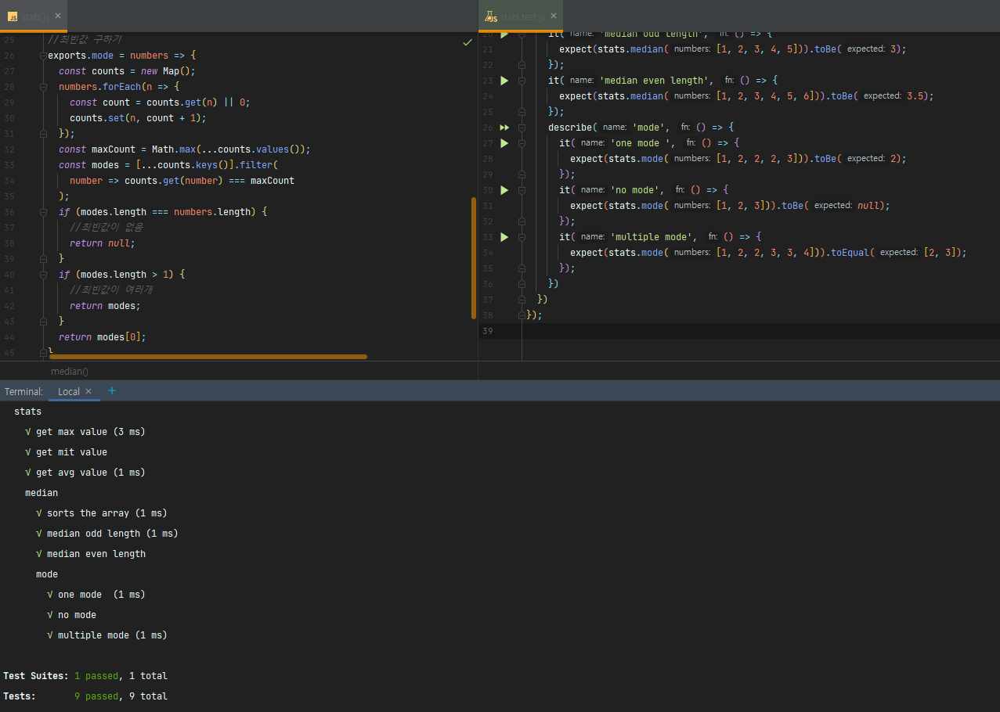

# JS로 하는 간단한 TDD 연습

## JS를 이용한 TDD학습을 위한 연습!

### jest 이용

### jest 설치

$yarn init -y = 새 자바스크립트 프로젝트 생성

$yarn add jest = jest 설치

package.json에 script 추가

{  
    "name": "TDD_TEST",  
    "version": "1.0.0",  
    "main": "index.js",  
    "license": "MIT",   
    "dependencies": {  
    "jest": "^26.6.3"  
}, 
"scripts": { 
"test": "jest --watchAll --verbose" 
    } 
}

$yarn test = 스크립트 실행(테스트 실행)

🎈함수를 여러개 쓸때는 describe로 묶어줍니다.

